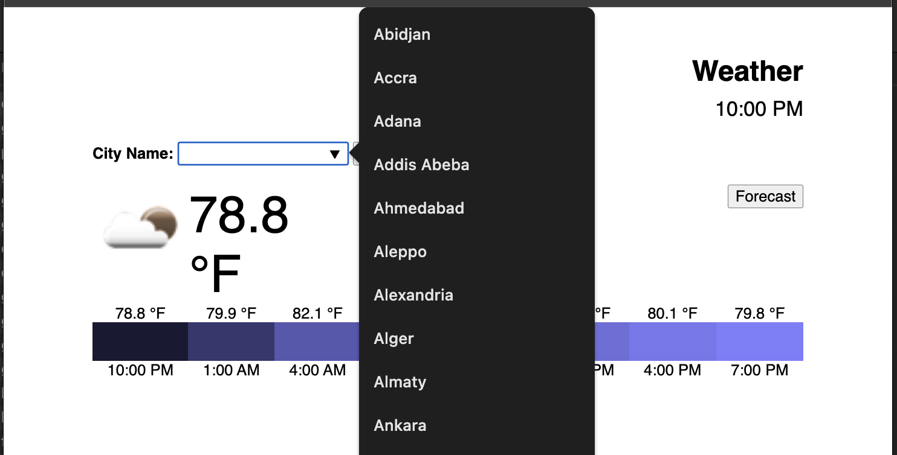
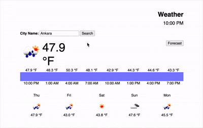

# Weather API Dashboard

## Overview
This project is a client-side weather dashboard that fetches data from:
https://www.allisonobourn.com/weather.php

The app loads a city list for autocomplete, shows today’s conditions with hourly entries, and renders a 5-day forecast. It includes loading states and graceful error handling. All DOM updates and network calls live in weather.js and are organized with a module pattern.

## Folder structure
| Path | Purpose |
|------|----------|
| `public/` | All static site files go here |
| `weather.html` | Home page |
| `weather.css` | Styles |
| `weather.js` | JavaScript logic |

## Fetch API
Base URL: https://www.allisonobourn.com/weather.php

Endpoints used by the app:
- City list: ?mode=cities
   - Returns a JSON array of city names for the autocomplete list.
- One-day forecast: ?mode=oneday&city=NAME
   - Returns JSON for the selected city’s current day, including time-stamped entries, icons, temperature, and cloud data.
- Five-day forecast: ?mode=week&city=NAME
   - Returns JSON for five days of forecast data used in the weekly view.

Notes:
- All requests use fetch() and parse JSON responses.
- The UI shows loading animations while requests are in flight.
- Errors and missing data are handled gracefully with user-friendly messaging.

## Features
### City List Loading
- On page load, the app fetches ?mode=cities.
- Populates the <datalist> for user autocomplete.

### Current Weather (Today)
- Fetches ?mode=oneday&city=NAME.
- Shows:
   - Time (converted from 24h → 12h format)
   - Current weather icon
   - Temperature (℉)
   - A list of forecast entries for the current day
   - Cloud cover visualized through background color

### Five-Day Forecast
- Fetches ?mode=week&city=NAME.
- Displays each day with the day name, weather icon, and temperature.

## Five-Day Forecast Details
The weekly view aggregates the API’s daily entries into five cards. Each card includes:
- Day of week
- Weather icon
- Temperature (℉)

## Screenshots

**Dashboard**

**Search**

**Live Demo**

## Run Locally
1. Open the project folder.
2. Open public/weather.html in a browser.

Optional: serve locally to avoid browser fetch restrictions.
- Using npm (http-server):
   - npm install -g http-server
   - http-server public
   - Then open http://localhost:8080/weather.html

## 🛠️ Tech Stack

- HTML5
- CSS3
- JavaScript (ES6)
- Fetch API
- PHP Weather Endpoint
